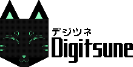

# 

Digitsune is a digital kitsune mask, designed around the Adafruit Circuit Playground Express microcontroller.
It consists of 6 WS2812B panels (1 8x8 and 5 32x8) and 2 standalone RGB LEDs.

Features include:
- 7 animated emotes, each with sound effects
- Volume-sensitive display mode
- Selectable color, with future potential for mixed RGB
- Controllable via a standard IR remote
